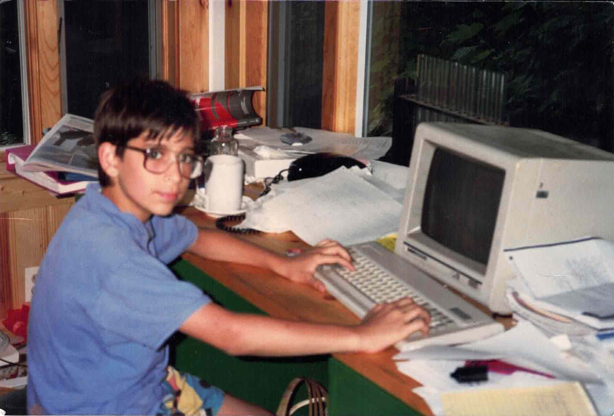

class: center
name: title
count: false

# DPLIRL (*)

.small[(*) Developing a prog lang in real life]

.p60[]

.me[.grey[*by* **Nicholas Matsakis**]]
.left[.citation[View slides at `https://nikomatsakis.github.io/OPLSS-2024/`]]

---

# Today's themes

* PhD: The best thing I'll never do again

--
* Life after academia

--
* Rust in the olden days

--
* Key moments and lessons

--
* Help wanted: interfacing with academia

---

# Who is this guy?

---

# My path

* 2001: Graduated MIT

--
* 2001–2004: Wrote a JIT for XSLT -- "wirespeed" XML!

--
* 2004-2011: PhD at ETH Zurich

--
* 2011-2024: Watching Rust grow

---

# TIL<sup>1</sup>: Nobody knows where they are going

Something I've never heard anyone successful say:

* "I had it all planned out from the beginning"

.footnote[
    <sup>1</sup> I consider TIL to mean "Things I learned", not "Today I learned". Sue me.
]

???

True at every stage. Including thesis:

* Pick something and start exploring.
* Ideas will come.

---

# TIL: The research spiral

You WILL feel like you are going in circles. A lot.

---

# TIL: Academics by and large give terrible talks

Present company excepted, of course.

--

EMOREJOKES people

---

# TIL: Professors are nice

OK, mostly.

--

.p60[]

--

Don't be shy!

---

# TIL: Professors don't know everything<sup>1</sup>

Don't tell anyone.

.footnote[
    <sup>1</sup> Reviewing these slides, my wife asked me to put, "but my wife does". No comment.
]

---

# What I got out of my PhD

* (let's be honest) the "union card"

--
* time to read [TAPL](https://www.cis.upenn.edu/~bcpierce/tapl/) cover to cover (recommended)

--
* the ability to decrypt academic papers 🕵🏼‍♂️ 

--
* met a bunch of amazing people
    * (a trend that continues to literally this minute with y'all!)

--

most importantly:

* the confidence to dive into an area, get oriented, and make a contribution

---

# What I did NOT get out of my PhD

--

* a strong publication record 😨

---

# TIL: Research happens everywhere

--

What I really like:

* Diving deep into new things
* Polishing ideas until they are smooth
* Communicating clearly
* Seeing the things I've helped to build empower others

--
* Getting paid 🤑

--

All possible in academia and industry, some easier than others

---
# Rust in the early days

Before me:

* Implemented in Ocaml, the infamous "rustboot"
* Became self-hosting

---
# Truer words were never spoken

> I’ve learned that people will forget what you said,<br>
> people will forget what you did,<br>
> but people will never forget how you made them feel.<br>
> <br>
> &mdash; Maya Angelou

???

We did not know where we were going

or how we were going to get there

but we knew how it should feel once we got there

---
# How we wanted it to feel

> A systems language<br>
> pursuing the trifecta:<br> 
> fast, concurrent, safe<br>
> <br>
> &mdash; Lindsey Kuper, then a Rust intern, now a famous professor

---
# Keywords: 5 characters or less

* `ret`

--
* `cont`

--
* later became `again`

--
* briefly became `loop` -- as in, `loop { if something { loop; } ... }`

--
* `alt`

---
# Code snippet

Looking back at some [early blog posts](https://smallcultfollowing.com/babysteps/blog/2011/12/07/rust-usability-problems/)...

.column55[
```
tag chain<copy K, copy V> {
    present(@entry<K, V>);
    absent;
}

type entry<copy K, copy V> = {
    hash: uint,
    key: K,
    mutable value: V,
    mutable next: chain<K, V>
};
```
]

.column40[
```
enum Chain<K, V> {
    Present(Rc<Entry<K, V>>),
    Absent,
}

struct Entry<K, V> {
    hash: usize,
    key: K,
    value: V,
    next: Chain<K, V>,
}
```
]

.abspos.width60.top300.left400[
    
]

---
# The sigils

Pointer patterns:

* `T` -- by value
* `@T` -- GC'd value, now `Rc<T>` or `Arc<T>`
* `~T` -- owned value, now `Box<T>`

--

Parameter modes
* `&x: T`, mutable reference (now, `x: &mut T`)
* `&&x: T`, const reference (now, `x: &T`)
* `-x: T`, "by move" (now, `x: T` where `T: !Copy`)
* `+x: T`, "by copy" (now, `x: T` and `x.clone()` at the callsite)
--

* `++x: T`, "by crash"

---

# Unsound

```
let c = present(@{ hash: 0, key: 0, value: 0, next: absent });
alt c {
    absent {}

    present(p) {
        c = absent;
        log p.hash;
    }
}
```

---
name: unsound

# Unsound

```rust
let mut c = Some(Rc::new(Entry { ... });
match &mut c {
    None => {}

    Some(p) {
        c = None;
        debug!("{:?}", p);
    }
}
```

---
template: unsound

.line1[]

---
template: unsound

.abspos.rotSE.width50.left100.top205[]

---
template: unsound

.abspos.rotSE.width50.left100.top205[]

---
template: unsound

.abspos.width50.left80.top260[]

---
template: unsound

.abspos.width50.left80.top290[]

---
# Iterator invalidation

```cpp
std::vector<std::string> vecOfStrings;

vecOfStrings.push_back("Hello");

auto& s = vecOfStrings[0];

vecOfStrings.push_back("World");

cout << s;
```

---
# Data race

```go
data := map[string]int{
    "apple":  1,
    "banana": 2,
}

go func() {
    fmt.Println(data["apple"])
}()

data["apple"] = 2
```

---
# "Sharing xor mutation"

All of these have two things in common:

* Aliasing
* Mutation

.footnote[
    I remember we gained a lot from Dan Grossman's [Existential Types for Imperative Languages](https://homes.cs.washington.edu/~djg/papers/exists_imp.pdf)
]

---
# "Sharing xor mutation"

| Access mode | Description        | Aliasing | Mutation |
| ----------- | ------------------ | -------- | -------- |
| `T`         | ownership          | ❌       | ✅       |
| `&mut T`    | mutable reference  | ❌       | ✅       |
| `&T`        | shared reference   | ✅       | ❌       |
| `Box<T>`    | heap-allocated box | ❌       | ✅       |
| `Rc<T>`     | ref-counted        | ✅       | ❌       |
| `Arc<T>`    | ref-counted        | ✅       | ❌       |

---
# Wasn't always this way

Had to drop two key assumptions:

* From C, copying pointers (`&mut T`) should be easy
* From ocaml, `mutable` on fields made them *always* mutable 

---
# TIL: Intractable situations -> drop a constraint

> When you have eliminated the impossible, whatever remains, however improbable, must be the truth?<br>
> <br>
> — Sherlock Holmes

i.e., "Investigate your base assumptions"

---
# TIL<sup>1</sup>: Believe in your good ideas

Modern borrow checker was born with ["IMHTWAMA"](https://smallcultfollowing.com/babysteps/blog/2012/11/18/imagine-never-hearing-the-phrase-aliasable/), proposed Nov 2012.

But it wasn't implemented until pcwalton drove it. I was too timid to push for it.

Thanks Patrick. 💜

.footnote[
<sup>1</sup> In truth, still learning this one.
]

---
# Storytime

---
# Story: Understanding our audience

Takeaways:

* Your first target should be the ones who can't get what they want.

---
# Story: first impressions matter

Takeaways:

* Great README, easy install (web if you can)

???

* Tooling: I didn't get this, I just cared about the language
* Error messages: first chance to teach your user
* Rayon's "meet cute" 

---
# Story: rustfmt

Takeaways:

* Incremental works better than all at once

---
# Story: Rust editions

Takeaways:

* Let people upgrade on *their* schedule

---
# Story: modeling, specs, and soundness

Takeaways:

* Models are tools
* Adoption requires compromises

---
# Story: non-lexical lifetimes

Takeaways:

* Simpler model ≠ Simpler to understand

---
# Interesting in helping to develop Rust?

Surprisingly few success stories:

* Case study: RFC 2229
* Case study: Ralf Jung and stacked borrows
